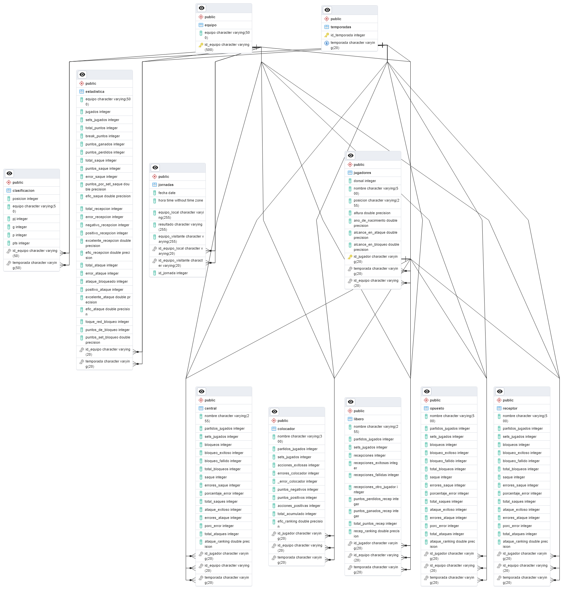
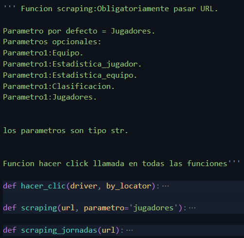
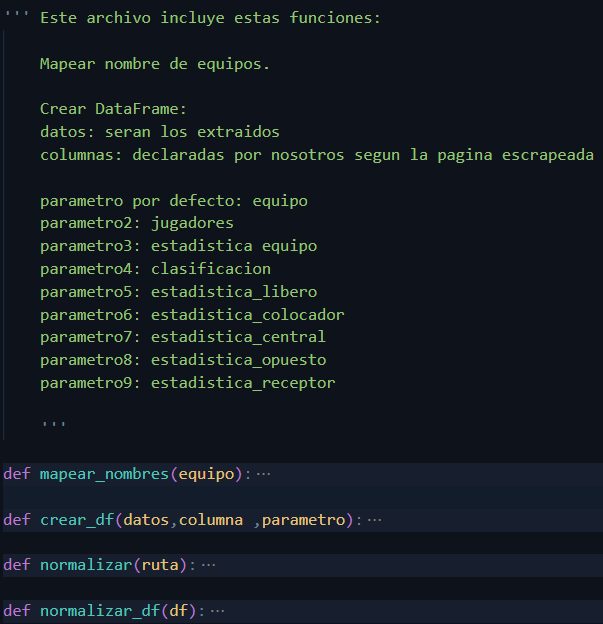
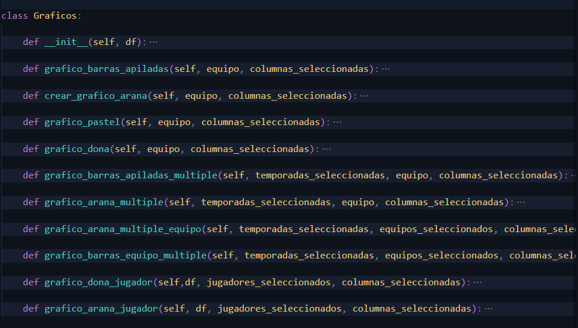
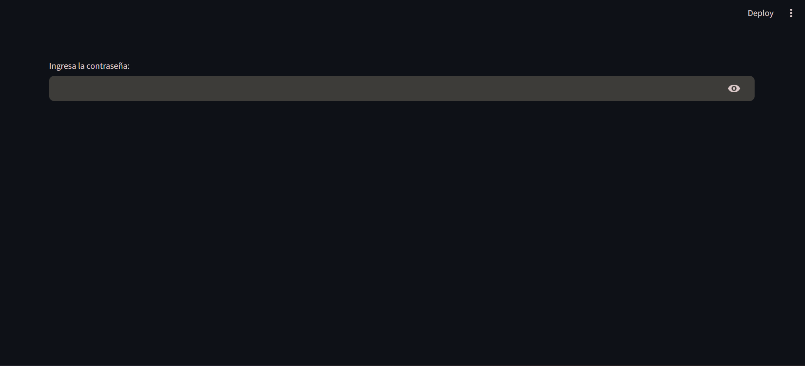
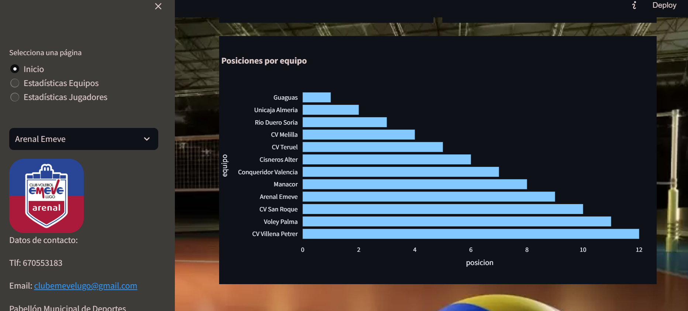

# VoleyStatsPro - Aplicación Web

## Desarrollador

### Alejandro Almeida Casna
Responsable del Desarrollo de la Aplicación

Fecha: 21, Enero, 2024

# Desarrollo
**Como equipo de desarrollo, asumimos el desafío de crear una aplicación web utilizando Python destinada a un club de voleibol. La aplicación tiene como objetivo principal proporcionar herramientas y funcionalidades específicas para facilitar el análisis de los equipos rivales. En colaboración estrecha con el cliente, hemos identificado y delineado una serie de requisitos fundamentales que guiarán nuestro proceso de desarrollo.**

**Extracción de Datos Inicial**
**Antes de comenzar con la implementación de las funcionalidades de la página web, llevamos a cabo una fase inicial de extracción de datos mediante scraping de estadísticas de la SuperLigaMasculina correspondientes a los últimos 5 años. Estos datos se cargaron directamente en una base de datos, asegurando un acceso constante a esta valiosa información.**

# Procesos de Desarrollo

  
Base de datos:

  Creamos una base de datos en PostgreSQL para almacenar todo lo extraído, en base a una consulta de creación.
  Relacionamos todas las tablas de la base de datos para optimizar las consultas y asegurar una eficiente recuperación de datos. 
  
  

  
Funciones Scraping:

  Creamos unas funciones que nos ayudarían a poder hacer scraping de toda la información necesaria. Sus parámetros son la URL y lo que deseamos scrapear, como equipos, estadísticas, clasificación, etc.
  

  
Funciones DataFrame:

  - Creamos una función que nos ayudaría a limpiar y organizar un DataFrame para que esté preparado para ser descargado como CSV y subirlo a la base de datos. Sus parámetros son los datos extraídos del scraping en crudo, el nombre de las columnas que deseamos, y nuevamente el parámetro que sería el tipo de DataFrame.

- Se implementaron dos funciones adicionales:

- La función mapear tiene como objetivo igualar los nombres de todos los equipos, ya que podían variar dependiendo de la temporada.
- La función normalizar se utiliza para que todos los datos estén sin acentuación y libres de caracteres específicos que podrían no ser adecuados para una base de datos.
  

  
Funciones Graficos:

  Creamos distintos tipos de gráficos para su utilización en la página web, con el propósito de visualizar los datos de una manera más atractiva.
  

### *En este punto, comenzamos con la implementación de los requisitos del desarrollador en un Frenwork(Streamlit).*

# Requisitos del Desarrollo

  
Seguridad:

    Dada la naturaleza confidencial de la información, implementaremos un sistema de seguridad que permita el acceso único.
    

Perfil del Equipos:

Registro detallado de información general del equipo, incluyendo nombre, ubicación y datos de contacto.

Información Actual de la Liga:

Tabla de posiciones presentada en formato de hoja de cálculo y gráfico de barras.
Tabla de partidos jugados y por jugar, con fechas respectivas y un selector para filtrar partidos específicos de un equipo.

Estadísticas de Equipos:

Estadísticas detalladas con un selector de temporada, equipo y tipo de gráfico.
Comparador de estadísticas de temporadas y equipos para visualizar las diferencias entre ellas.

Estadísticas de Jugadores:

Estadísticas detalladas por jugador en una posición específica, con opciones de comparación mediante un selector de gráfico.

# Conclusiones

- Optimización del Análisis Rival:
La aplicación cumple su objetivo principal al proporcionar una herramienta efectiva para analizar equipos rivales en voleibol.
- Acceso Constante a Estadísticas Relevantes:
La carga de datos en la base de datos garantiza un acceso constante a estadísticas actualizadas de la SuperLigaMasculina de los últimos 5 años.

- Seguridad y Privacidad: La implementación de un sistema de seguridad asegura la protección de la información sensible de cada equipo.

- Interfaz Intuitiva y Funcionalidades Avanzadas: La interfaz de usuario se ha diseñado de manera intuitiva, facilitando la navegación y el uso de las diversas funcionalidades.

- Cumplimiento de Requisitos Específicos: Todos los requisitos definidos con el cliente han sido abordados y cumplidos satisfactoriamente.

- Perspectivas de Mejora Continua: Se identifican áreas de mejora y expansión, como la posible incorporación de nuevas funcionalidades o adaptación a cambios en las reglas y dinámicas de la SuperLigaMasculina.

- Satisfacción del Usuario: La satisfacción del usuario se considera un indicador clave del éxito de la aplicación, y se fomenta la recopilación de comentarios para futuras actualizaciones.

# Próximos Pasos
- Preentrenamiento para Análisis de Rendimiento en Vóley:
Desarrollar un sistema capaz de detectar el balón de vóley en videos para analizar el rendimiento de equipos en situaciones clave.
- Implementación de Características Adicionales:
Considerar la posibilidad de agregar nuevas características, como análisis predictivo, notificaciones en tiempo real, etc.

- Mantenimiento Continuo: Establecer un plan de mantenimiento continuo para abordar problemas de seguridad y garantizar la compatibilidad con futuras versiones de Python y otras dependencias.
Expansión a Otras Ligas o Categorías:

- Expansión a Otras Ligas o Categorías:  Evaluar la relevancia de expandir la aplicación para incluir estadísticas y análisis de otras ligas o categorías de voleibol.

- Interfaz Gráfica: Establecer contacto con profesionales especializados en UX-IA para mejorar la visualización específica de la página.

# Librerías Utilizadas:

- [**Python**](https://www.python.org):  El lenguaje de programación principal utilizado para implementar el proceso ETL y llevar a cabo el análisis.En este proyecto se utiliza Python 3.11.5.

- [**Selenium**](https://www.selenium.dev/documentation/): Una herramienta de automatización web utilizada para interactuar con sitios web y obtener datos de chat de sitios que no proporcionan una API directa.

- [**Sqlalchemy**](https://docs.sqlalchemy.org/en/20/): Una herramienta SQL de Python y un kit de herramientas de ORM que proporciona una manera más sencilla de interactuar con bases de datos SQL.

- [**Re**](https://docs.python.org/3/library/re.html): Una librería en Python para trabajar con expresiones regulares, que son patrones de búsqueda y coincidencia de texto. 

- [**Time**](https://docs.python.org/3/library/time.html): Una librería en Python para trabajar con operaciones relacionadas con el tiempo. Es útil para medir intervalos de tiempo y pausar la ejecución de un programa.

- [**Streamlit**](https://streamlit.io/): Streamlit es un marco de desarrollo de código abierto en Python que simplifica considerablemente la creación de aplicaciones web 

- [**Request**](https://docs.python-requests.org/en/latest/): Una librería en Python que facilita el envío de solicitudes HTTP/1.1. Es muy útil para realizar peticiones web.

- [**Unicode**](https://pypi.org/project/Unidecode/#description): Una librería para transliterar cadenas Unicode a su representación ASCII. Útil para normalizar y limpiar datos de texto.

- [**Pandas**](https://pandas.pydata.org/getting_started.html): Una librería de análisis de datos en Python. Proporciona estructuras de datos flexibles y herramientas de manipulación de datos.

- [**NumPy**](https://numpy.org/doc/stable/): Una librería fundamental para la computación numérica en Python. Proporciona soporte para arrays y operaciones matemáticas eficientes.

- [**Plotly Express**](https://plotly.com/python/): Una librería para crear gráficos interactivos de manera sencilla y rápida.

